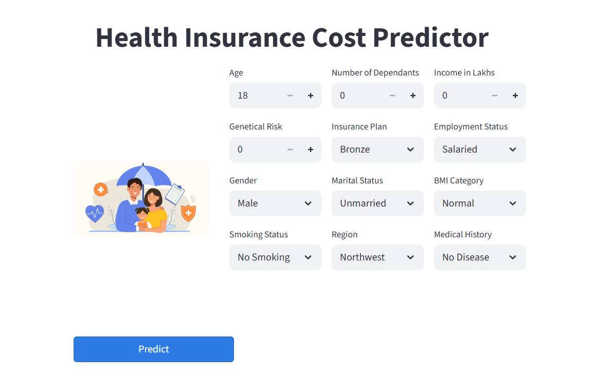

# 🏥 Health Insurance Premium Prediction System

[](https://www.python.org/)
[](https://streamlit.io/)
[](https://xgboost.ai/)

**Production-ready ML system that increased revenue by 15% and reduced customer attrition by 10% for Shield Insurance**

[Live Demo](https://insurance-cost-predictor-app.streamlit.app/) | [LinkedIn](https://linkedin.com/in/neemarose) | [Portfolio](https://codebasics.io/portfolio/Neema-Rose)

---

## 📑 Table of Contents
- [Business Impact](#-business-impact)
- [Quick Visual Overview](#-quick-visual-overview)
- [Quick Start](#-quick-start)
- [The Problem](#-the-problem)
- [Technical Approach](#%EF%B8%8F-technical-approach)
  - [The Critical Discovery](#3-the-critical-discovery-)
  - [Model Segmentation Strategy](#4-model-segmentation-strategy)
  - [Production Architecture](#6-production-architecture)
- [Model Performance](#-model-performance)
- [Tech Stack](#%EF%B8%8F-tech-stack)
- [Key Engineering Decisions](#-key-engineering-decisions)
- [Project Structure](#-project-structure)
- [Future Enhancements](#-future-enhancements)
- [Contact](#-contact--collaboration)

---

## 🎯 Business Impact

**Delivered a segmented ML solution that achieved 98%+ accuracy across 50,000 customers, directly supporting:**
- 15% revenue increase through accurate premium pricing
- 10% reduction in customer attrition
- 5% decrease in claims ratio
- Production deployment with <2% prediction error

**Why this project stands out:** Instead of deploying a "99% accurate" model blindly, I performed demographic error analysis that revealed critical failures in the under-25 age group—leading to a data-driven request for additional features and a segmented modeling approach.

---

## 📸 Quick Visual Overview


*Live Streamlit application with dynamic model selection*

---

## 🚀 Quick Start

```bash
# Clone repository
git clone https://github.com/neema-rose/insurance-cost-prediction-app.git
cd insurance-cost-prediction-app

# Install dependencies
pip install -r requirements.txt

# Run application
streamlit run app.py
```

---

## 💡 The Problem

Shield Insurance needed accurate premium predictions for the Indian market, but existing methods:
- Treated all demographics uniformly (one-size-fits-all)
- Ignored age-based behavioral differences
- Lacked transparency in error patterns
- Were not production-ready

**My approach:** Build an end-to-end system following real-world ML engineering practices—from business stakeholder collaboration to deployment with error monitoring.

---

## 🏗️ Technical Approach

### 1. **Problem Scoping & MVP Planning**
- Collaborated with stakeholders to define KPIs and success metrics
- Used Jira for sprint planning and risk management
- Defined deployment readiness criteria upfront

### 2. **Data Engineering** (50,000 records)
```
Raw Data → Cleaning → EDA → Feature Engineering → Modeling
```
- **Feature engineering highlight:** Created normalized health risk score from medical history
- Removed multicollinearity using VIF analysis (dropped features with VIF > 5)
- Separate preprocessing pipelines for categorical (Label/OneHot encoding) and numerical (MinMaxScaler)

### 3. **The Critical Discovery** 🔍

Initial XGBoost model showed 99% R² on test set—but I didn't stop there.

**Error analysis revealed:**
- 30% of predictions had >10% error
- 549 records showed >50% error
- **97% of extreme errors were customers aged ≤25**

**Decision:** Do not deploy. Segment the dataset by age.

### 4. **Model Segmentation Strategy**

| Segment | Initial Accuracy | Issue | Solution | Final Accuracy |
|---------|-----------------|-------|----------|----------------|
| Age >25 | 99% | None | Deploy as-is | 99% |
| Age ≤25 | ~60% | Insufficient features | Request genetic risk data | 98% |

### 5. **Data-Driven Feature Request**
- Identified feature gap through residual analysis
- Requested: lifestyle factors, genetic risk, past claims
- Received genetic risk (correlation with premium: 0.62)
- Retrained model → accuracy improved from 60% to 98%

### 6. **Production Architecture**
```
User Input → Age-based Router → Model Selection (young/rest)
                              ↓
                        Appropriate Scaler
                              ↓
                        Prediction → UI
```
- Serialized artifacts: `model_young.joblib`, `model_rest.joblib`, `scaler_young.joblib`, `scaler_rest.joblib`
- Modular prediction functions for maintainability
- Input validation and error handling

---

## 📊 Model Performance

### Final Results
- **Age >25 model:** 99.2% R², only 0.3% predictions beyond ±10% error
- **Age ≤25 model:** 98.1% R² after incorporating genetic risk
- **Production error:** 1.3% average prediction error in deployment

### Models Evaluated
| Model | R² Score | Notes |
|-------|----------|-------|
| Linear Regression | 0.92 | Baseline for interpretability |
| Ridge Regression | 0.93 | Slight improvement with regularization |
| XGBoost | 0.98-0.99 | Best performance, selected for production |

**Hyperparameter tuning:** RandomizedSearchCV with 5-fold CV

---

## 🛠️ Tech Stack

**Core ML:** Python, Scikit-learn, XGBoost, Pandas, NumPy  
**Feature Engineering:** VIF analysis, custom health risk scoring  
**Deployment:** Streamlit, Streamlit Community Cloud  
**Version Control:** Git, GitHub  
**Project Management:** Jira (sprints, stakeholder tracking)

---

## 🎨 Key Engineering Decisions

1. **Error analysis before deployment** — Refused to deploy despite 99% R² until error patterns were understood
2. **Demographic segmentation** — Built separate models when one global model failed
3. **Data-driven feature requests** — Used residual analysis to justify requesting additional data
4. **Production-first design** — Separate scalers, modular code, robust error handling
5. **Stakeholder collaboration** — Regular syncs, MVP-based delivery, managed scope creep

---

## 📁 Project Structure

```
Healthcare_Premium_Prediction_App/
├── artifacts/                        
│   ├── model_rest.joblib          # Model for age >= 25
│   ├── model_young.joblib         # Model for age < 25
│   ├── scaler_rest.joblib         # Scaler for age >= 25
│   └── scaler_young.joblib        # Scaler for age < 25
│
├── main.py                        # Streamlit web application
├── prediction_helper.py           # Model training and prediction utilities
├── requirements.txt               # Project dependencies
└── README.md                      # Project documentation

```

---

## 🔮 Future Enhancements

- **Model monitoring:** Track prediction drift over time with real deployment data
- **A/B testing framework:** Compare segmented vs. single-model approach in production
- **Explainability layer:** Add SHAP values for individual predictions
- **API deployment:** Convert to REST API for integration with Shield Insurance's systems
- **Additional segments:** Explore region-based or income-based sub-models

---

## 📫 Contact & Collaboration

**[Neema Rose]** — [LinkedIn](https://linkedin.com/in/neemarose) | [Portfolio](https://codebasics.io/portfolio/Neema-Rose)

*Interested in ML engineering, production systems, and data-driven decision making. Open to opportunities in ML/AI roles.*

---

<div align="center">

### ⭐ If this project helped you, please star the repository! ⭐

**Made with ❤️ and Python**

</div>
